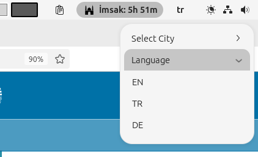
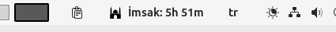
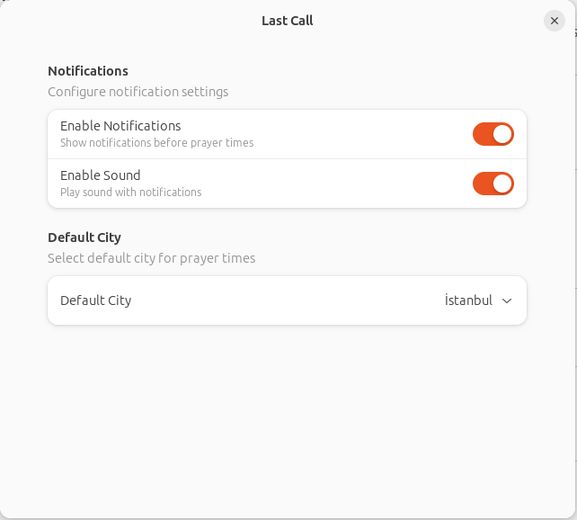

# Language EN
## Last Call

**Author:** [faymaz](https://github.com/faymaz)









_Last Call_ is a GNOME Shell extension that displays upcoming prayer times by fetching data from the official website of the Presidency of Religious Affairs of Turkey (Diyanet İşleri Başkanlığı). It shows the next prayer time and the remaining time in the GNOME Shell top panel. The extension provides notifications and sound alerts as prayer times approach. It supports multiple cities and allows users to select their preferred city.

### Features

- **Displays the next prayer time and remaining minutes.**
- **Fetches prayer times from the Diyanet official website.**
- **Supports multiple cities selectable from the extension settings.**
- **Provides notifications and sound alerts 15-20 minutes before prayer times.**
- **Multilingual support (Turkish and English).**

### Installation

#### Requirements

- **GNOME Shell 46** or later.
- **GNOME Extensions** must be enabled on your system.
- A command-line sound player like **`paplay`** or **`aplay`** should be installed.

#### Steps

1. **Clone the Repository**

   ```bash
   git clone https://github.com/faymaz/last-call.git ~/.local/share/gnome-shell/extensions/last-call@faymaz
   ```

2. **Compile the GSettings Schema**

   ```bash
   glib-compile-schemas ~/.local/share/gnome-shell/extensions/last-call@faymaz/schemas/
   ```

3. **Restart GNOME Shell**

   - **If using Xorg:**

     - Press `Alt` + `F2`, type `r`, and press `Enter`.

   - **If using Wayland:**

     - Log out and log back in.

4. **Enable the Extension**

   Use GNOME Tweaks or the GNOME Extensions app to enable the **"Last Call"** extension.

### Usage

- The extension adds an **icon** to the GNOME Shell top panel.
- Click on the icon to access the extension menu.
- The **next prayer time** and **remaining minutes** will be displayed.
- To **change the city**, open the extension settings:

  - **Using GNOME Tweaks:**

    - Go to the **Extensions** tab.
    - Find the **"Last Call"** extension and click the **settings** icon.

  - **Using the GNOME Extensions App:**

    - Locate the **"Last Call"** extension.
    - Click the **settings** icon to open the preferences.

- In the settings window, you can select your desired **city** from the dropdown list.

### Adding Cities

If you want to add new cities, you can edit the **`cities.json`** file:

```json
{
  "cities": [
    {
      "name": "Istanbul",
      "url": "https://namazvakitleri.diyanet.gov.tr/en-US/9541/prayer-time-for-istanbul"
    },
    {
      "name": "Ankara",
      "url": "https://namazvakitleri.diyanet.gov.tr/en-US/9206/prayer-time-for-ankara"
    }
    // You can add more cities...
  ]
}
```

- **Note:** Ensure that the URLs you add point to the correct pages on the Diyanet official website.

### Localization

The extension provides **multilingual support**. If you would like to contribute translations, you can submit a pull request with the appropriate **`.po`** files.

### Troubleshooting

- **Settings Not Opening / Error Message:**

  If you encounter an error like **`TypeError: prefsModule.default is not a constructor`**, please check the following:

  - Ensure that your **`metadata.json`** file does **not** include the **`"hasPrefs": true`** or **`"prefs"`** keys. As of GNOME Shell 45 and later, these keys are no longer used.
  - Verify that your **`prefs.js`** file exports a function named **`fillPreferencesWindow`**.

- **Extension Not Loading / Icon Not Appearing:**

  - Check the GNOME Shell logs for errors:

    ```bash
    journalctl /usr/bin/gnome-shell -f -o cat
    ```

  - Make sure the extension is installed in the correct directory.
  - Don't forget to **compile the schemas**.

### Contributing

We welcome contributions! Please use the [GitHub repository](https://github.com/faymaz/last-call) to report issues and submit pull requests.

- **To set up your development environment:**

  - Refer to the [GNOME Shell Extension Development Guide](https://gjs.guide/extensions/).
  - Use APIs and libraries compatible with your version of GNOME Shell.

### License

This project is licensed under the **MIT License**. See the [LICENSE](LICENSE) file for details.

---

**Note:** To ensure the extension works smoothly, please follow the installation steps carefully. If you encounter any issues, feel free to open an **issue** on GitHub.

Happy coding!

---

# Last Call - Prayer Times based on Diyanet's schedule GNOME Shell Extension


**Last Call** is a GNOME Shell extension that provides prayer times for various cities and alerts you with a sound notification 15 minutes before the next prayer time. The extension allows users to dynamically select their city and displays the remaining time until the next prayer directly on the GNOME top panel. The icon in the panel changes periodically, and sound notifications are triggered at the appropriate time.

## Features

- Displays prayer times for different cities (e.g., Irvine, New York, New Jersey, Frankfurt, Istanbul, Ankara).
- Notifies users with a sound (call.mp3) 15 minutes before the next prayer time.
- Allows users to switch between different cities using a menu.
- The top panel icon changes every two seconds to provide a dynamic appearance.
- Supports multiple languages (currently English and Turkish).

    ```bash
    msgfmt -o locale/en/LC_MESSAGES/lastcall.mo locale/en/LC_MESSAGES/lastcall.po
    msgfmt -o locale/tr/LC_MESSAGES/lastcall.mo locale/tr/LC_MESSAGES/lastcall.po
    ```


## Usage

Once the extension is installed and activated, you will see an icon in the GNOME top panel. By default, the extension will fetch prayer times for the city of Istanbul. You can change the city by clicking on the panel icon and selecting a different city from the dropdown menu.

The panel icon will change every two seconds to give a dynamic appearance. The remaining time until the next prayer will be calculated and, when 15 minutes remain, the `call.mp3` sound file will play as a notification.

## Customization

- **Icons**: The extension uses two icons (`icon.svg`) located in the `icons/` directory. You can customize these icons or replace them with your own.
- **Sound Notification**: The sound file used for the notification is `call.mp3`, located in the `sounds/` directory. You can replace this file with your own sound by keeping the file name `call.mp3`.

## Contributing

Feel free to fork the repository and submit pull requests with your changes. Any contributions, including bug fixes, translations, or new features, are welcome!

## License

This project is licensed under the MIT License. See the [LICENSE](LICENSE) file for details.

## Credits

Developed by [faymaz](https://github.com/faymaz).

Special thanks to the Diyanet prayer times service for providing the data.


# Language TR

## Last Call

**Yazar:** [faymaz](https://github.com/faymaz)

_Last Call_, Diyanet İşleri Başkanlığı'nın web sitesinden namaz vakitlerini çekerek bir sonraki namaz vaktini ve kalan süreyi GNOME Shell üst panelinde gösteren bir eklentidir. Namaz vakti yaklaşırken bildirim gönderir ve sesli uyarı verir. Birden fazla şehri destekler ve kullanıcıların şehir seçimi yapmasına olanak tanır.

### Özellikler

- **Bir sonraki namaz vaktini ve kalan süreyi gösterir.**
- **Namaz vakitlerini Diyanet İşleri Başkanlığı'nın web sitesinden çeker.**
- **Eklenti ayarlarından seçilebilir birden fazla şehir desteği.**
- **Namaz vakti yaklaştığında (15-20 dakika önce) bildirim ve sesli uyarı verir.**
- **Çoklu dil desteği (Türkçe ve İngilizce).**

### Kurulum

#### Gereksinimler

- **GNOME Shell 46** veya üzeri.
- Sistemde **GNOME Extensions** etkinleştirilmiş olmalı.
- **`paplay`** veya **`aplay`** gibi komut satırı ses oynatıcıları yüklü olmalı.

#### Adımlar

1. **Depoyu Klonlayın**

   ```bash
   git clone https://github.com/faymaz/last-call.git ~/.local/share/gnome-shell/extensions/last-call@faymaz
   ```

2. **GSettings Şemasını Derleyin**

   ```bash
   glib-compile-schemas ~/.local/share/gnome-shell/extensions/last-call@faymaz/schemas/
   ```

3. **GNOME Shell'i Yeniden Başlatın**

   - **Xorg Kullanıyorsanız:**

     - `Alt` + `F2` tuşlarına basın, `r` yazıp `Enter` tuşuna basın.

   - **Wayland Kullanıyorsanız:**

     - Oturumu kapatıp tekrar açın.

4. **Eklentiyi Etkinleştirin**

   GNOME Tweaks veya GNOME Extensions uygulamasını kullanarak **"Last Call"** eklentisini etkinleştirin.

### Kullanım

- **Eklenti**, GNOME Shell üst paneline bir **simge** ekler.
- Simgeye tıklayarak eklenti menüsüne erişebilirsiniz.
- **Bir sonraki namaz vakti** ve **kalan süre** görüntülenecektir.
- **Şehir değiştirmek** için eklenti ayarlarını açın:

  - **GNOME Tweaks:**

    - **Extensions** sekmesine gidin.
    - **"Last Call"** eklentisini bulun ve **ayarlar** simgesine tıklayın.

  - **GNOME Extensions Uygulaması:**

    - **"Last Call"** eklentisini bulun.
    - **Ayarlar** simgesine tıklayarak ayarları açın.

- Ayarlar penceresinde, açılır listeden istediğiniz **şehri seçebilirsiniz**.

### Şehir Ekleme

Yeni şehirler eklemek isterseniz, **`cities.json`** dosyasını düzenleyebilirsiniz:

```json
{
  "cities": [
    {
      "name": "İstanbul",
      "url": "https://namazvakitleri.diyanet.gov.tr/tr-TR/9541/istanbul-icin-namaz-vakti"
    },
    {
      "name": "Ankara",
      "url": "https://namazvakitleri.diyanet.gov.tr/tr-TR/9206/ankara-icin-namaz-vakti"
    }
    // Daha fazla şehir ekleyebilirsiniz...
  ]
}
```

- **Not:** Eklediğiniz şehirlerin URL'lerinin Diyanet İşleri Başkanlığı web sitesindeki doğru sayfalara yönlendirdiğinden emin olun.

### Lokalizasyon

Eklenti **çoklu dil desteği** sağlar. Çevirilere katkıda bulunmak isterseniz, uygun **`.po`** dosyalarıyla bir pull request gönderebilirsiniz.

### Sorun Giderme

- **Ayarlar Açılmıyor / Hata Mesajı:**

  Eğer **`TypeError: prefsModule.default is not a constructor`** gibi bir hata alıyorsanız, aşağıdakileri kontrol edin:

  - **`metadata.json`** dosyanızda **`"hasPrefs": true`** veya **`"prefs"`** anahtarlarının bulunmadığından emin olun. GNOME Shell 45 ve sonrasında bu anahtarlar kullanılmamaktadır.
  - **`prefs.js`** dosyanızın **`fillPreferencesWindow`** adlı bir fonksiyonu ihraç ettiğinden emin olun.

- **Eklenti Yüklenmiyor / Simge Görünmüyor:**

  - GNOME Shell loglarında hata olup olmadığını kontrol edin:

    ```bash
    journalctl /usr/bin/gnome-shell -f -o cat
    ```

  - Eklentinin doğru dizine yüklendiğinden emin olun.
  - **Şemaları derlemeyi** unutmayın.

### Katkıda Bulunma

Katkılarınızı bekliyoruz! Sorunlar ve pull request'ler için [GitHub deposunu](https://github.com/faymaz/last-call) kullanabilirsiniz.

- **Geliştirme ortamınızı ayarlamak için:**

  - GNOME Shell Extension [Geliştirme Kılavuzu](https://gjs.guide/extensions/)’nu inceleyin.
  - GNOME Shell sürümünüzle uyumlu API ve kütüphaneleri kullanın.

### Lisans

Bu proje **MIT Lisansı** ile lisanslanmıştır. Detaylar için [LICENSE](LICENSE) dosyasına bakabilirsiniz.


